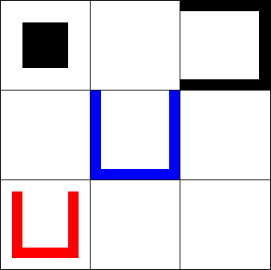
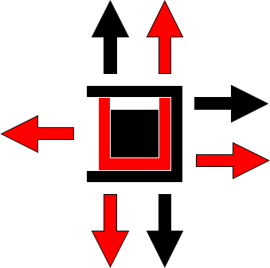

sliding-puzzle-game-2025
========================

Consider a tray consisting of three rows and three columns, and also four movable pieces that are arranged in the tray as shown below:

Three of the pieces, called the shoes, are U-shaped; the remaining one, called the block, has a square shape. In a move, the block can be moved to a neighboring square (consider the squares that are to the left, right, top, or bottom). The block can not pass through the solid sides of the shoes; however, it can be moved inside them across their open side. When the block is inside a shoe, they can move together: the block can push the shoe to the target square if their path is not blocked by another shoe on the target square. However, note that the red shoe can be moved inside one of the other two shoes. Thus, the block can move together with two shoes. The goal of the puzzle is to move the red shoe inside the blue shoe.

The image below demonstrates how the block can move together with one or two shoes:

The puzzle can be solved in 24 steps as follows:

1. RIGHT
2. DOWN
3. LEFT
4. UP
5. RIGHT
6. RIGHT
7. DOWN
8. DOWN
9. LEFT
10. UP
11. UP
12. LEFT
13. DOWN
14. RIGHT
15. UP
16. LEFT
17. DOWN
18. DOWN
19. RIGHT
20. RIGHT
21. UP
22. UP
23. LEFT
24. DOWN
